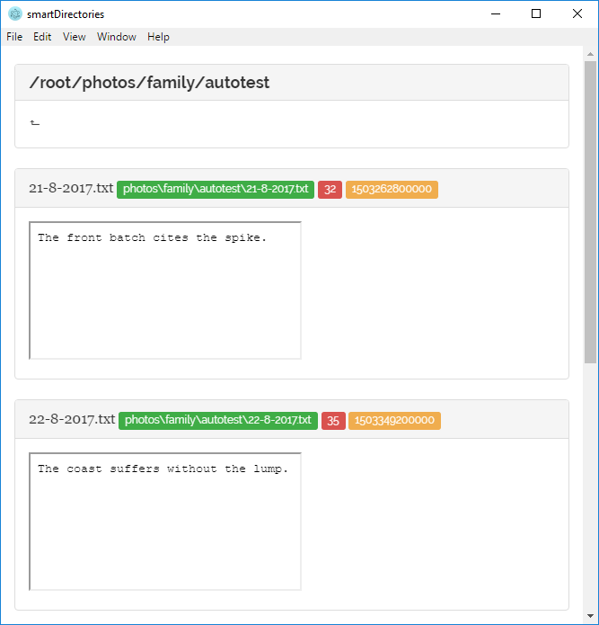

# smartDirectories ☄️
> Explore your files in a chronological order

[![NPM Version][npm-image]][npm-url]

- Explore files in a chronological order based on file name
- Supports all sorts of files and date formats
- Describe pictures by adding a text file with the same name
- Tag and organize files better



## Installation

In the current state not ready for distribution

## Usage example

- Add descriptions to photos
- Make a diary
- See pictures from different sources on a same timeline


## Development setup

```sh
git clone https://github.com/gladiatortoise/smartDirectories
npm install
npm start
```

## Development Progress

Implemented:
- Basic user interface
- Basic functioning (25 files max / directory)
- Support for txt, png, jpg and jpeg

To be implemented:
- Support for tags and flags in file names
- Search, order, how many files per page etc.
- Support for settings shown in roadmap.txt